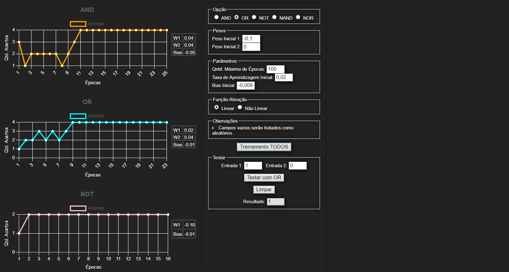

# Perceptron - AND, OR e NOT

Pequeno exercício para a aula de SIN323 - Inteligência Artificial ministrada na Universidade Federal de Viçosa <i>campus</i> Rio Paranaíba - 2023/2, onde foi desenvolvido um código que treina um <i>Perceptron</i> para os operadores lógicos AND, OR e NOT.

    

## Para o professor:
- O código do perceptron se encontra neste repositório no arquivo <i><u>[script.js](https://github.com/EricLamounier/Perceptron/blob/main/script.js)</u></i>.

## Para acessar o site, basta clicar no link abaixo:
[Clique aqui para acessar a página](https://ericlamounier.github.io/Perceptron/)

## Tecnologias utilizadas

- HTML5
- CSS3
- JavaScript

## Contato
eric.botelho@ufv.br

eric_lamounier@outlook.com